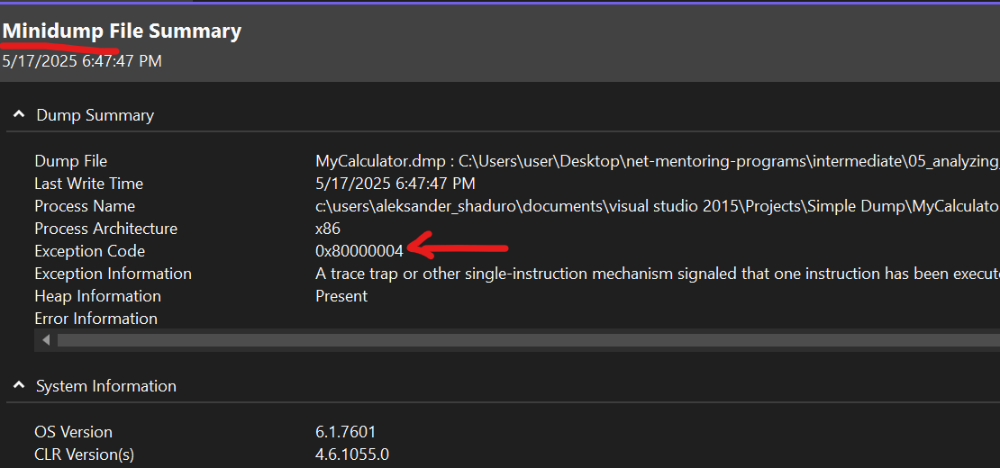
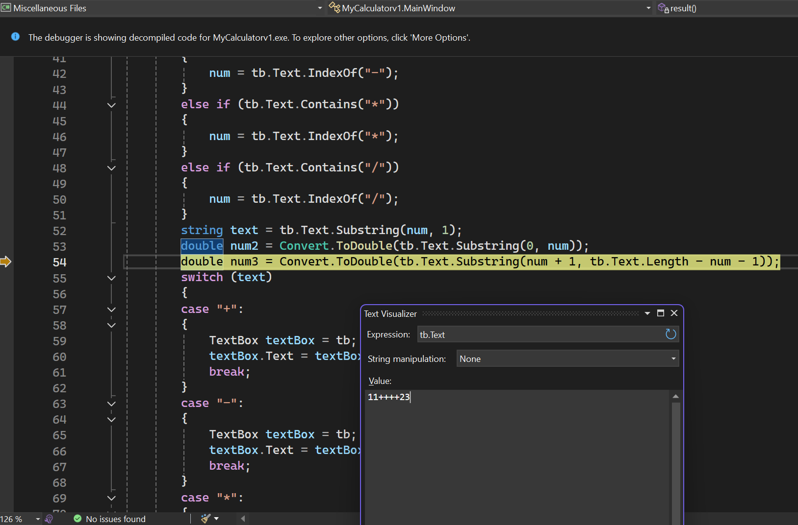

# Task 4
We have DumpHomework application which caused an exception and you have a dump file for this exception. Define a place of the error and try to solve it.


## The Problems

As can be seen in the screenshot, we have a minidump with an Exception Code: 0x80000004, this is the EXCEPTION_SINGLE_STEP.



The MINIDUMP_EXCEPTION structure that can be found here:

https://learn.microsoft.com/en-us/windows/win32/api/minidumpapiset/ns-minidumpapiset-minidump_exception

This exception signals a single-instruction trap, typically seen when generating a minidump during a debug session.

So, when we open the MyCalculator.exe and the MyCalculator.dmp files using Visual Studio 2022, we get this:



Opening MyCalculator.exe and MyCalculator.dmp in Visual Studio 2022 reveals the application state just before it would throw an InvalidFormatException. For example, entering "11++++23" triggers a failure one step before proper error handling.

Analysis of the decompiled code reveals several flaws:

- Poor naming. Variables like “num” lack descriptive meaning. Clear names are essential for maintainability, for example:

```cs
    int num = 0;
```

- Missing validation for unsupported input. The code locates operators with checks such as “if the text contains "^" but does not handle cases where no supported operator is present. This leads to invalid substring indexes and crashes.

```cs
    else if (tb.Text.Contains("/"))
    {
	    num = tb.Text.IndexOf("/");
    }
    // missing final else
```

- Operator checks and computations are duplicated throughout the code, this kind of duplication increases the risk of typos and makes extending functionality cumbersome.

- To add a new operator—such as exponentiation—you must modify the MainWindow class directly instead of extending behavior, so we get a violation of the Open/Closed Principle.

- MainWindow handles UI wiring, input validation, parsing, calculation, and error handling. Mixing these concerns hinders testability and clarity.

- The user is not notified when something goes wrong, and the application suddenly closes.


## The Solution

To solve these issues, we should refactor as follows:

- Create a Validator class to verify the expression, if validation fails, throw a FormatException containing the collected errors. It will assume an expression like this "{number1}{Operator}{Number2}"

- Create a Parser class to obtain operands and operator.

- Create a Calculator class dedicated solely to performing computations, it should depend on an expression validator and a parser, both injected through its constructor. In the MainWindow class, when the user clicks to get a result, it should call the Calculator class’s Calculate method.


```cs
    public double Calculate(string expression)
    {
        if (!_validator.IsValid(expression))
        {
            throw new FormatException(
               string.Join("; ", _validator.GetErrors(expression)));
        }

        var (num1, op, num2) = _parser.Parse(expression);

        if (op == '/' && right == 0)
            throw new DivideByZeroException();

        return /**make calculations**/
    }
```
